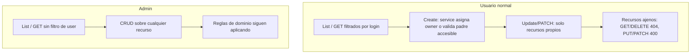

# FinTrack — Flujos de ownership por entidad

Guía de **cómo se comporta cada entidad** para un **usuario normal** (`user`) y para **`ROLE_ADMIN`** (`admin`).

Complementa:

- [`IMPLEMENTATION.md`](IMPLEMENTATION.md) — tracker técnico por entidad
- [`TESTING.md`](TESTING.md) — tests y comandos

**Estado:** 17 / 17 entidades con ownership implementado.

---

## Convenciones globales

### Quién es quién

| Actor          | Login típico | Rol                                                                                           |
| -------------- | ------------ | --------------------------------------------------------------------------------------------- |
| Usuario normal | `user`       | Solo ve y muta **sus** recursos (salvo excepciones documentadas)                              |
| Admin          | `admin`      | `CurrentUserService.isAdmin()` → bypass de **visibilidad y CRUD** en casi todas las entidades |

### HTTP cross-user (todas las entidades)

Cuando un usuario normal intenta operar un recurso que **no le pertenece**:

| Operación   | Código             | Motivo                                           |
| ----------- | ------------------ | ------------------------------------------------ |
| GET         | `404`              | No filtrar existencia de recursos ajenos         |
| DELETE      | `404`              | Idem                                             |
| PUT / PATCH | `400` `idnotfound` | Convención del proyecto (no `404` en mutaciones) |

El admin **no recibe estos errores** por ownership: puede GET/PUT/PATCH/DELETE recursos ajenos.

### Dónde vive la lógica

```
REST (@Valid forma) → Service (ownership + negocio) → Repository (queries scoped)
```

- El cliente/UI **no elige el dueño** en entidades Pattern A (salvo que el DTO lo acepte, el service lo ignora o preserva).
- Los links (cuentas, categorías, tags, etc.) se resuelven en service contra entidades **accesibles** del usuario actual.

### Patrones de ownership

| Pattern | Cómo se determina el dueño | Entidades                                                                                                                |
| ------- | -------------------------- | ------------------------------------------------------------------------------------------------------------------------ |
| **A**   | Campo `user` directo       | FinancialAccount, Category, Tag, Budget, FinancialSubscription, TransactionRule, ApiAccessToken, UserDashboardPreference |
| **B**   | Vía padre 1 nivel          | FinancialTransaction → `account.user`; CreditAccountDetails → `account.user`                                             |
| **C**   | Vía cadena                 | TransactionRuleCondition → `transactionRule.user`; ApiAccessTokenPermission → `apiAccessToken.user`                      |
| **D**   | Regla compuesta            | InternalTransfer (2 tx, mismo user/moneda)                                                                               |

---

## Diagrama mental



**Importante:** admin bypass = **visibilidad y acceso CRUD**, no siempre bypass de **reglas de negocio** (ver excepciones por entidad).

---

## 1. FinancialAccount (Pattern A)

**Dueño:** `user` asignado en create por el service.

### Usuario normal

| Flujo               | Comportamiento                                                 |
| ------------------- | -------------------------------------------------------------- |
| **List / criteria** | Solo cuentas con `user.login = currentUser`                    |
| **GET**             | Solo si la cuenta es suya; ajena → `404`                       |
| **POST**            | Service asigna `user = currentUser`; ignora `user` del payload |
| **PUT / PATCH**     | Solo cuentas propias; preserva owner; ajena → `400`            |
| **DELETE**          | Solo propias; ajena → `404`                                    |
| **UI**              | Sin selector de User                                           |

### Admin

| Flujo                    | Comportamiento                                                                                                 |
| ------------------------ | -------------------------------------------------------------------------------------------------------------- |
| **List / GET**           | Todas las cuentas                                                                                              |
| **POST**                 | Sigue asignando `currentUser` (admin) salvo que el producto evolucione — hoy el service usa `getCurrentUser()` |
| **PUT / PATCH / DELETE** | Cualquier cuenta                                                                                               |

---

## 2. FinancialTransaction (Pattern B)

**Dueño:** implícito vía `account.user`.

### Usuario normal

| Flujo                            | Comportamiento                                                                                                                                                                   |
| -------------------------------- | -------------------------------------------------------------------------------------------------------------------------------------------------------------------------------- |
| **List / criteria**              | Solo txs cuya `account.user.login = currentUser`                                                                                                                                 |
| **GET**                          | Solo txs de cuentas propias; ajena → `404`                                                                                                                                       |
| **POST**                         | `account` debe ser accesible (`findAccessibleAccountEntity`); `origin = MANUAL`; `transactionIngestion = null`; amount > 0; category/tags/subscription opcionales pero **owned** |
| **PUT / PATCH**                  | Solo propias; preserva `origin` e `ingestion`; links owned; ajena → `400`                                                                                                        |
| **DELETE**                       | Solo propias; ajena → `404`                                                                                                                                                      |
| **Candidatos internal transfer** | Endpoints `/outgoing-internal-transfer-candidates` y `/incoming-internal-transfer-candidates`: solo txs propias, filtradas OUT/IN + sin link en ningún rol; origin no filtra     |

### Admin

| Flujo                           | Comportamiento                                                                                          |
| ------------------------------- | ------------------------------------------------------------------------------------------------------- |
| **List / GET**                  | Todas las txs                                                                                           |
| **POST / PUT / PATCH / DELETE** | Cualquier tx (con validaciones de negocio: amount, links resolubles, etc.)                              |
| **Candidatos transfer**         | Ve candidatos de **todos** los users; create de InternalTransfer igual exige mismo owner en ambas patas |

---

## 3. Category (Pattern A)

**Dueño:** `user` directo. Jerarquía opcional `parentCategory`.

### Usuario normal

| Flujo           | Comportamiento                                                                                  |
| --------------- | ----------------------------------------------------------------------------------------------- |
| **List / GET**  | Solo categorías propias                                                                         |
| **POST**        | `user = currentUser`; `parentCategory` null o categoría **propia**; anti-ciclo y no self-parent |
| **PUT / PATCH** | Solo propias; owner inmutable; parent owned                                                     |
| **DELETE**      | Solo propias; ajena → `404`                                                                     |

### Admin

| Flujo                | Comportamiento                                                                           |
| -------------------- | ---------------------------------------------------------------------------------------- |
| **CRUD**             | Cualquier categoría                                                                      |
| **Reglas jerarquía** | Siguen aplicando (parent owned del mismo user de la categoría, no cross-owner en parent) |

---

## 4. Tag (Pattern A)

**Dueño:** `user` directo. Mismo esquema que Category sin jerarquía.

### Usuario normal

| Flujo                    | Comportamiento                                           |
| ------------------------ | -------------------------------------------------------- |
| **List / GET**           | Solo tags propios                                        |
| **POST**                 | `user = currentUser`                                     |
| **PUT / PATCH / DELETE** | Solo propios; ajeno GET/DELETE → `404`, mutación → `400` |

### Admin

| Flujo    | Comportamiento |
| -------- | -------------- |
| **CRUD** | Cualquier tag  |

---

## 5. Budget (Pattern A + M2M)

**Dueño:** `user` directo. Links M2M: `accounts`, `categories`, `tags`.

### Usuario normal

| Flujo           | Comportamiento                                               |
| --------------- | ------------------------------------------------------------ |
| **List / GET**  | Solo budgets propios                                         |
| **POST**        | `user = currentUser`; cada id en M2M debe pertenecer al user |
| **PUT / PATCH** | Solo propios; M2M ⊆ entidades owned; owner inmutable         |
| **DELETE**      | Solo propios                                                 |

### Admin

| Flujo         | Comportamiento                                                                      |
| ------------- | ----------------------------------------------------------------------------------- |
| **CRUD**      | Cualquier budget                                                                    |
| **M2M links** | Deben seguir siendo entidades **del dueño del budget** (no mezclar owners en links) |

---

## 6. FinancialSubscription (Pattern A + links)

**Dueño:** `user` directo. Links opcionales: `account`, `category`, `tags`.

### Usuario normal

| Flujo          | Comportamiento                                                                      |
| -------------- | ----------------------------------------------------------------------------------- |
| **List / GET** | Solo subscriptions propias                                                          |
| **POST**       | `user = currentUser`; links opcionales pero owned                                   |
| **PUT**        | Links owned si presentes                                                            |
| **PATCH**      | `JsonNode`: campo ausente → preserva link; `null` limpia ManyToOne; `[]` limpia M2M |
| **DELETE**     | Solo propias                                                                        |

### Admin

| Flujo     | Comportamiento                                                                      |
| --------- | ----------------------------------------------------------------------------------- |
| **CRUD**  | Cualquier subscription                                                              |
| **Links** | Account/category/tags deben pertenecer al **dueño de la subscription**, no al admin |

---

## 7. TransactionRule (Pattern A + links)

**Dueño:** `user` directo. Outputs: `resultingCategory`, `resultingTags`.

### Usuario normal

| Flujo           | Comportamiento                                                         |
| --------------- | ---------------------------------------------------------------------- |
| **List / GET**  | Solo rules propias                                                     |
| **POST**        | `user = currentUser`; outputs opcionales ⊆ **mismo owner que la rule** |
| **PUT / PATCH** | Solo propias; outputs validados contra **owner de la rule**            |
| **DELETE**      | Solo propias                                                           |

### Admin

| Flujo                   | Comportamiento                                                                                |
| ----------------------- | --------------------------------------------------------------------------------------------- |
| **CRUD rule**           | Puede ver/editar/borrar rules ajenas                                                          |
| **Outputs (excepción)** | **No bypass:** category/tags deben ser del **dueño de la rule**, no del admin ni de otro user |

---

## 8. TransactionRuleCondition (Pattern C)

**Dueño:** vía `transactionRule.user`.

> **Breaking change:** `transactionRule` es **inmutable tras create**. Reparent (incluso mismo owner) **ya no permitido**. Mover condition = delete + create.

### Usuario normal

| Flujo                       | Comportamiento                                                                        |
| --------------------------- | ------------------------------------------------------------------------------------- |
| **List / GET**              | Solo conditions cuya rule es propia                                                   |
| **POST**                    | `transactionRule` requerido y accesible (rule propia); foreign parent → `400` invalid |
| **PUT / PATCH**             | Solo si la condition es accesible; **`transactionRule` inmutable**                    |
| **PATCH `transactionRule`** | Ausente → preserva; mismo `{id}` → OK; otro `{id}` → `400`; `null` → `400`            |
| **DELETE**                  | Solo propias (vía rule) → `404` si ajena                                              |

### Admin

| Flujo                           | Comportamiento                                                |
| ------------------------------- | ------------------------------------------------------------- |
| **CRUD**                        | Conditions de rules ajenas                                    |
| **POST foreign parent**         | Permitido                                                     |
| **PUT/PATCH `transactionRule`** | **Inmutable** — otro `{id}` → `400` aunque mismo owner        |
| **`ACCOUNT` field values**      | Validar ids contra **`transactionRule.user.login`**, no admin |

---

## 9. CreditAccountDetails (Pattern B)

**Dueño:** vía `account.user`. OneToOne con `FinancialAccount`.

### Usuario normal

| Flujo               | Comportamiento                                                             |
| ------------------- | -------------------------------------------------------------------------- |
| **List / GET**      | Solo details de cuentas propias                                            |
| **POST**            | `account` accesible, tipo `CREDIT_CARD`, sin details previos en esa cuenta |
| **PUT / PATCH**     | Solo propios; **`account` inmutable** tras create                          |
| **PATCH `account`** | Ausente → preserva; `null` → `400`; otro `{id}` → `400`                    |
| **DELETE**          | Solo propios                                                               |

### Admin

| Flujo            | Comportamiento                                                     |
| ---------------- | ------------------------------------------------------------------ |
| **CRUD**         | Details de cuentas de cualquier user                               |
| **Validaciones** | Siguen: CREDIT_CARD only, un details por cuenta, account inmutable |

---

## 10. ApiAccessToken (Pattern A)

**Dueño:** `user` directo. Credencial API (hash no expuesto en lecturas). **Sin FK** desde `ApiIngestion` — auditoría histórica vía snapshots (decisión **11C**).

### Usuario normal

| Flujo            | Comportamiento                                                                                                                                                                                                                                                |
| ---------------- | ------------------------------------------------------------------------------------------------------------------------------------------------------------------------------------------------------------------------------------------------------------- |
| **List / GET**   | Solo tokens propios; **`tokenHash` omitido** en respuesta                                                                                                                                                                                                     |
| **POST**         | Strict name-only request DTO; `user = currentUser`; server always generates `tokenHash` + `tokenPrefix`; returns `rawToken` once; client-provided secret/owner/server fields → `400`                                                                          |
| **PUT / PATCH**  | PUT strict editable-fields request DTO; PATCH `JsonNode` for absent/null semantics; `tokenHash` / `tokenPrefix` / `createdAt` / `updatedAt` / `lastUsedAt` / `revokedAt` **server-owned**; owner immutable; `ACTIVE`→`REVOKED` OK; `REVOKED`→`ACTIVE` → `400` |
| **PATCH `user`** | Ausente → preserva; `null` → `400`                                                                                                                                                                                                                            |
| **DELETE**       | Solo propios; borra permisos hijos; **no** borra `ApiIngestion` ni transactions; UI usa React Router `Link` (no full-page reload)                                                                                                                             |

### Admin

| Flujo         | Comportamiento                                                                |
| ------------- | ----------------------------------------------------------------------------- |
| **CRUD**      | Tokens de cualquier user                                                      |
| **DELETE**    | Puede borrar token ajeno; ingestions históricas siguen visibles por snapshots |
| **Seguridad** | Hash sigue sin exponerse en GET/list; secretos inmutables                     |

### REVOKE vs DELETE (11C)

| Acción     | Efecto                                                                         |
| ---------- | ------------------------------------------------------------------------------ |
| **REVOKE** | Deshabilita token; fila visible; bloquea **nueva** ingestion                   |
| **DELETE** | Elimina fila; bloquea **nueva** ingestion; historial en `ApiIngestion` intacto |
| **UI**     | Copy de delete aclara que el historial de ingestion **no** se elimina ✅       |

---

## 11. ApiAccessTokenPermission (Pattern C)

**Dueño:** vía `apiAccessToken.user`.

### Usuario normal

| Flujo           | Comportamiento                                                           |
| --------------- | ------------------------------------------------------------------------ |
| **List / GET**  | Solo permisos de tokens propios                                          |
| **POST**        | Token accesible; `createdAt` server; sin duplicado `(token, permission)` |
| **PUT / PATCH** | `apiAccessToken`, `permission`, `createdAt` **inmutables** tras create   |
| **PATCH token** | Ausente → preserva; `null` → `400`; otro `{id}` → `400`                  |
| **DELETE**      | Solo propios                                                             |

### Admin

| Flujo          | Comportamiento                                                |
| -------------- | ------------------------------------------------------------- |
| **CRUD**       | Permisos de tokens ajenos                                     |
| **Inmutables** | Parent token, permission y createdAt siguen fijos tras create |

---

## 12. UserDashboardPreference (Pattern A + 1:1)

**Dueño:** `user` directo. Máximo **una** fila por user.

### Usuario normal

| Flujo            | Comportamiento                                                    |
| ---------------- | ----------------------------------------------------------------- |
| **List / GET**   | Solo preference propia (como mucho 1)                             |
| **POST**         | `user = currentUser`; falla si ya existe preference para ese user |
| **PUT / PATCH**  | Solo propia; owner inmutable; **`configuration` mutable**         |
| **PATCH `user`** | Ausente → preserva; `null` → `400`                                |
| **DELETE**       | Solo propia                                                       |

### Admin

| Flujo         | Comportamiento                         |
| ------------- | -------------------------------------- |
| **CRUD**      | Preferences de cualquier user          |
| **1:1 guard** | Sigue aplicando por `user_id` al crear |

---

## 13. InternalTransfer (Pattern D)

**Dueño:** ambas patas `outgoingTransaction` e `incomingTransaction` → cuentas del **mismo user**.

### Usuario normal

| Flujo           | Comportamiento                                                                                                                                    |
| --------------- | ------------------------------------------------------------------------------------------------------------------------------------------------- |
| **List / GET**  | Solo transfers donde **out e in** pertenecen a sus cuentas                                                                                        |
| **POST**        | Enlaza txs existentes accesibles; valida: distintas cuentas, misma moneda/monto, OUT+IN, MANUAL, mismo owner, sin link previo; `createdAt` server |
| **PUT / PATCH** | Solo propios; patas y `createdAt` **inmutables**; solo `notes` mutable                                                                            |
| **PATCH patas** | Ausente → preserva; `null` → `400`; otro `{id}` → `400`                                                                                           |
| **DELETE**      | Solo propios; **borra solo el transfer**; las dos txs siguen vivas                                                                                |
| **UI create**   | Selectores desde candidatos OUT/IN (propios, MANUAL, sin link)                                                                                    |

### Admin

| Flujo                                 | Comportamiento                                                                                                   |
| ------------------------------------- | ---------------------------------------------------------------------------------------------------------------- |
| **List / GET / PUT / PATCH / DELETE** | Transfers de cualquier user                                                                                      |
| **POST (excepción)**                  | Puede resolver txs ajenas, pero **create bloquea cross-owner**: ambas patas deben ser del **mismo user** siempre |
| **Candidatos**                        | Ve txs candidatas de todos los users; la validación de create impide mezclar owners                              |

---

## Tabla resumen — Admin bypass

| Entidad                  | Admin ve/edita ajenos                              | Regla que **no** tiene bypass admin                               |
| ------------------------ | -------------------------------------------------- | ----------------------------------------------------------------- |
| FinancialAccount         | ✅                                                 | —                                                                 |
| FinancialTransaction     | ✅                                                 | —                                                                 |
| Category                 | ✅                                                 | Parent debe ser del owner de la categoría                         |
| Tag                      | ✅                                                 | —                                                                 |
| Budget                   | ✅                                                 | M2M ⊆ owner del budget                                            |
| FinancialSubscription    | ✅                                                 | Links ⊆ owner de la subscription                                  |
| TransactionRule          | ✅                                                 | Outputs ⊆ owner de la rule                                        |
| TransactionRuleCondition | ✅                                                 | Parent immutable; ACCOUNT vs rule owner; reparent **removed**     |
| CreditAccountDetails     | ✅                                                 | CREDIT_CARD, 1:1, account inmutable                               |
| ApiAccessToken           | ✅                                                 | Hash no expuesto; secretos inmutables                             |
| ApiAccessTokenPermission | ✅                                                 | Parent/grant/createdAt inmutables                                 |
| UserDashboardPreference  | ✅                                                 | 1:1 por user en create                                            |
| InternalTransfer         | ✅ CRUD                                            | **Create: mismo owner en ambas patas**                            |
| TransactionIngestion     | ✅ CRUD                                            | `account` / `ingestionType` inmutables; server defaults en create |
| FileIngestion            | ✅ create/read/update dates; direct delete blocked | Parent `FILE` + 1:1; metadata inmutable; delete via parent        |
| ApiIngestion             | ✅ create/read/no-op update; direct delete blocked | Parent `API` + 1:1; token snapshots; metadata inmutable           |

---

## 14. TransactionIngestion (Pattern B)

**Dueño:** vía `account.user`.

### Usuario normal

| Flujo           | Comportamiento                                                                                                                                         |
| --------------- | ------------------------------------------------------------------------------------------------------------------------------------------------------ |
| **List / GET**  | Solo ingestions cuya `account` es propia                                                                                                               |
| **POST**        | `account` accesible; `ingestionType` required; server: `PENDING`, timestamps, contadores `0`; ignora `status`/`completedAt`/`errorMessage` del cliente |
| **PUT / PATCH** | Solo propias; `account` e `ingestionType` inmutables; mutables: status, sourceLabel, completedAt, errorMessage, contadores                             |
| **DELETE**      | Solo propias; ajena → `404`                                                                                                                            |

### Admin

| Flujo    | Comportamiento                         |
| -------- | -------------------------------------- |
| **CRUD** | Cualquier ingestion                    |
| **POST** | Puede crear con `account` de otro user |

---

## 15. FileIngestion (Pattern C)

**Dueño:** vía `transactionIngestion.account.user`.

### Usuario normal

| Flujo           | Comportamiento                                                                                          |
| --------------- | ------------------------------------------------------------------------------------------------------- |
| **List / GET**  | Solo `FileIngestion` cuya `transactionIngestion.account` es propia                                      |
| **POST**        | Parent accesible (repo scoped), `ingestionType = FILE`, sin `FileIngestion` previo; server `createdAt`  |
| **PUT / PATCH** | Solo propios; **`transactionIngestion` y metadata archivo inmutables**; sólo statement dates mutables   |
| **DELETE**      | Direct delete propio → `400`; ajeno → `404`; cleanup pertenece a `TransactionIngestionService.delete()` |

### Admin

| Flujo                          | Comportamiento                                                           |
| ------------------------------ | ------------------------------------------------------------------------ |
| **Read/update mutable fields** | Cualquier `FileIngestion`; no bypass de inmutables                       |
| **POST**                       | Puede crear con `transactionIngestion` de otro user (si FILE y sin hijo) |
| **DELETE**                     | Direct delete también bloqueado → `400`                                  |

---

## 16. ApiIngestion (Pattern C + token snapshot audit — 11C)

**Dueño:** vía `transactionIngestion.account.user`. **Sin FK** a `ApiAccessToken`. En create, el service copia metadata del token autenticado a campos snapshot inmutables (`apiTokenIdSnapshot`, `apiTokenPrefixSnapshot`, `apiTokenNameSnapshot`). Same-owner entre ingestion y token aplica **solo en create** (incluso admin).

### Usuario normal

| Flujo           | Comportamiento                                                                                                                                                                                        |
| --------------- | ----------------------------------------------------------------------------------------------------------------------------------------------------------------------------------------------------- |
| **List / GET**  | Solo `ApiIngestion` cuya `transactionIngestion.account` es propia; muestra snapshots aunque token borrado                                                                                             |
| **POST**        | Parent ingestion accesible (scoped), `ingestionType = API`, sin hijo previo, same-owner con token usado para snapshots, `requestId` unique; server `createdAt`/`receivedAt`; **no persiste FK token** |
| **PUT / PATCH** | Solo propios; no campos mutables v1; mismo payload/no-op OK; cambios/null en metadata, parent, snapshots, `requestId` o timestamps → `400`                                                            |
| **DELETE**      | Direct delete bloqueado para propios → `400`; ajeno → `404`; cleanup vía `TransactionIngestion`                                                                                                       |

### Admin

| Flujo                        | Comportamiento                                                                                       |
| ---------------------------- | ---------------------------------------------------------------------------------------------------- |
| **Read/create/no-op update** | Cualquier `ApiIngestion` visible (scoping bypass), pero sin bypass de inmutables ni delete directo   |
| **POST**                     | Padre ingestion ajeno OK solo si **mismo owner** que token usado para snapshots; cross-owner → `400` |
| **DELETE**                   | Direct delete bloqueado → `400`; cleanup vía parent                                                  |

---

## 17. IngestionRecord (Pattern C + optional FT)

**Dueño:** vía `transactionIngestion.account.user`. **Same-owner:** si viene `financialTransaction`, `financialTransaction.account.user.login` debe coincidir con el de la ingestion — **incluso admin**.

### Usuario normal

| Flujo                  | Comportamiento                                                                                                                        |
| ---------------------- | ------------------------------------------------------------------------------------------------------------------------------------- |
| **List / GET / count** | Solo records cuya `transactionIngestion.account` es propia                                                                            |
| **POST**               | `transactionIngestion` accesible (scoped); FT opcional accesible; same-owner; guards 1:1 FT y `recordIndex` único; server `createdAt` |
| **PUT / PATCH**        | Solo propios; **`transactionIngestion` / `financialTransaction` / `recordIndex` / `createdAt` inmutables**; metadata mutable          |
| **DELETE**             | Solo propios; ajeno → `404`                                                                                                           |

### Admin

| Flujo    | Comportamiento                                                    |
| -------- | ----------------------------------------------------------------- |
| **CRUD** | Cualquier `IngestionRecord` (scoping bypass)                      |
| **POST** | `transactionIngestion` ajena OK; cross-owner ingestion+FT → `400` |

### Helper UI (create)

| Endpoint                                                   | Comportamiento                                                                                   |
| ---------------------------------------------------------- | ------------------------------------------------------------------------------------------------ |
| `GET /api/financial-transactions/ingestion-record-is-null` | FT accesibles sin `IngestionRecord` ligado (scoped; filtro por `existsByFinancialTransactionId`) |

---

## Referencia rápida — Códigos HTTP

```
Usuario normal + recurso ajeno:
  GET    → 404
  DELETE → 404
  PUT    → 400
  PATCH  → 400

Admin + recurso ajeno:
  → 200/201/204 según operación (si pasa validaciones de negocio)

Validación de negocio (cualquier rol):
  IllegalArgumentException → 400 invalid
```

---

_Última actualización: 2026-07-09 — incluye IngestionRecord (pattern C + optional FT + same-owner). 17/17 complete._
